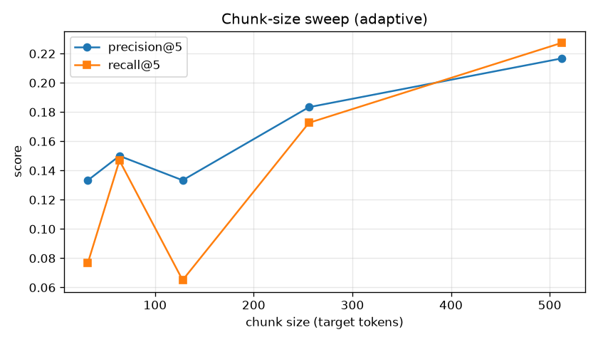

# tiny-rag-with-reranking

A small, readable RAG pipeline over a real public-domain document set:
chunk -> embed (bi-encoder) -> FAISS retrieval -> cross-encoder reranking, with
retrieval precision/recall measured before and after reranking, and a chunk-size
sweep that picks a chunking strategy by measured retrieval quality.

## Problem

Retrieval-augmented generation lives or dies on retrieval. A bi-encoder embeds
the query and each passage independently and compares vectors, which is fast but
blurs fine-grained relevance, so the truly-relevant passage often sits a few
ranks below where it should. Two levers fix this without touching the generator:
rerank the shortlist with a cross-encoder that reads each (query, passage) pair
jointly, and chunk the source text at the right granularity so a passage carries
enough context without diluting the relevant span. This repo builds both and
measures the effect on precision@k and recall@k instead of asserting it.

## Approach

- Four chunking strategies in `src/chunking.py`: fixed-token, sentence-aware,
  sliding-window with overlap, and an original `adaptive` strategy that merges
  short sentences up to a target size and splits any single over-long sentence.
  Every chunk carries `[start, end)` character offsets back into its source.
- Bi-encoder embedding (`all-MiniLM-L6-v2`) with L2-normalized vectors so a FAISS
  inner-product index computes cosine similarity directly.
- Cross-encoder reranker (`ms-marco-MiniLM-L-6-v2`) re-scores only the retrieved
  top-N, which is where the accuracy gain is cheap.
- Relevance is labeled by answer substring, not by chunk id, so the eval set
  stays valid no matter how the corpus is chunked. This is what makes the
  chunk-size sweep an apples-to-apples comparison.
- The chunk-size sweep chooses the chunking configuration empirically by
  precision@k / recall@k rather than by a guessed constant.

## Setup

```
# 1. create a virtual environment (either tool)
uv venv --python 3.12 .venv
# or: python -m venv .venv
# then activate it (Windows: .venv\Scripts\activate ; Unix: source .venv/bin/activate)

# 2. install torch from the CUDA 12.8 index first (RTX 5090 / sm_120), then the rest
pip install torch --index-url https://download.pytorch.org/whl/cu128
pip install -r requirements.txt

# 3. copy the env template (no secrets required)
cp .env.example .env
```

`.env` needs nothing for public models. `HF_TOKEN` is optional and only speeds up
or authorizes Hugging Face model downloads.

## How to run

Run the pipeline in order from the repo root:

```
# 0. fetch the corpus (a few Project Gutenberg books) into data/corpus/
python scripts/00_prepare_corpus.py

# 1. chunk + embed + build the FAISS index
python scripts/01_build_index.py --strategy adaptive --size 128

# 2. precision/recall before vs after cross-encoder reranking
python scripts/02_eval_rerank.py --retrieve 20 --k 5

# 3. sweep chunk sizes to find the sweet spot (writes outputs/sweep.png)
python scripts/03_sweep_chunk_size.py --strategy adaptive --sizes 32 64 128 256 512 --k 5
```

Run the tests (pure-python, no model downloads needed):

```
pytest -q
```

## Results

Numbers below are real measurements from an actual run on a single RTX 5090
(24 GB, sm_120). Models: bi-encoder `sentence-transformers/all-MiniLM-L6-v2`
and cross-encoder `cross-encoder/ms-marco-MiniLM-L-6-v2`. Corpus: 3 public-domain
Project Gutenberg books (Alice in Wonderland, The Time Machine, A Study in
Scarlet), 12 hand-written eval queries with substring relevance labels. This is a
small-scale benchmark; absolute values are low because the eval set is tiny and
labels a passage relevant only by exact answer substring.

Reranking effect (`scripts/02_eval_rerank.py --retrieve 20 --k 5`, adaptive
chunks at size 128):

| stage                    | precision@k | recall@k |
|--------------------------|-------------|----------|
| bi-encoder only          | 0.1333      | 0.0650   |
| + cross-encoder rerank   | 0.2000      | 0.1394   |

The cross-encoder pass raised precision@5 by +0.0667 (0.1333 to 0.2000) and
recall@5 by +0.0744 over bi-encoder-only retrieval, because it reads each
(query, passage) pair jointly and pushes the genuinely-relevant chunk up the
ranking.

Chunk-size sweep (`scripts/03_sweep_chunk_size.py --strategy adaptive --sizes 32
64 128 256 512 --k 5`, bi-encoder retrieval, plotted in `docs/sweep.png`):

| chunk size | n_chunks | precision@k | recall@k |
|------------|----------|-------------|----------|
| 32         | 3426     | 0.1333      | 0.0769   |
| 64         | 1730     | 0.1500      | 0.1469   |
| 128        | 902      | 0.1333      | 0.0650   |
| 256        | 426      | 0.1833      | 0.1726   |
| 512        | 207      | 0.2167      | 0.2273   |

Best size by precision@k: **512**. In this small three-book corpus retrieval
quality rose with chunk size across the swept range, so the largest size (512)
scored best on both precision and recall rather than a middle value. Larger
chunks carry more surrounding context per passage, which helps the bi-encoder
match short answer spans in this corpus; the theoretical too-large penalty would
show up on a bigger, denser corpus or at chunk sizes past what was swept here.



## What I'd do next at larger scale

Swap the flat FAISS index for an IVF/HNSW index and shard the corpus so
retrieval stays sub-linear as the document count grows into the millions. Replace
the substring relevance labels with graded human judgments and report nDCG/MRR
alongside precision/recall, and batch the cross-encoder across queries on GPU so
reranking a large shortlist stays cheap.
